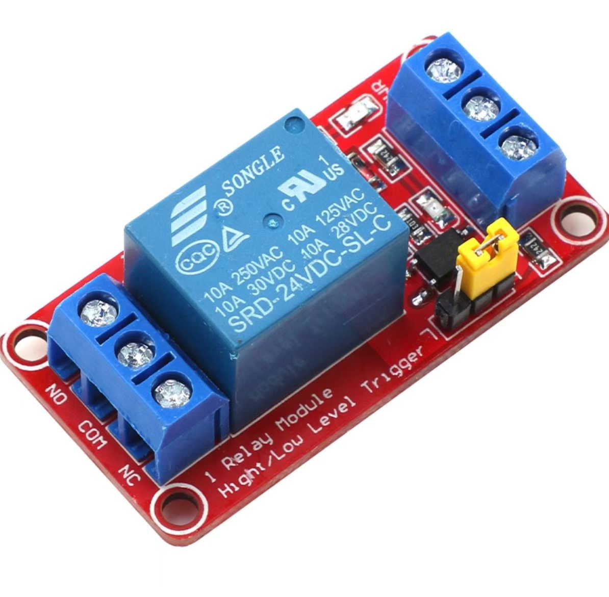
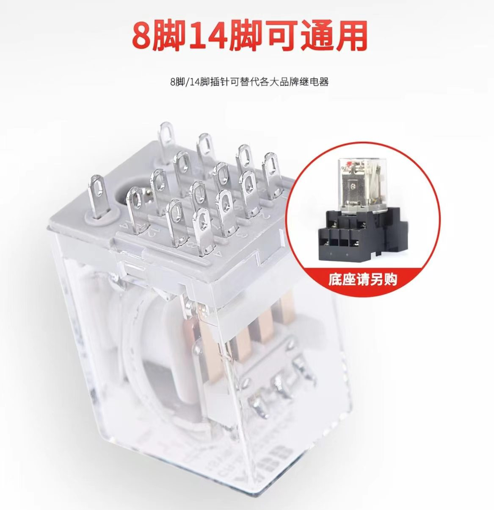
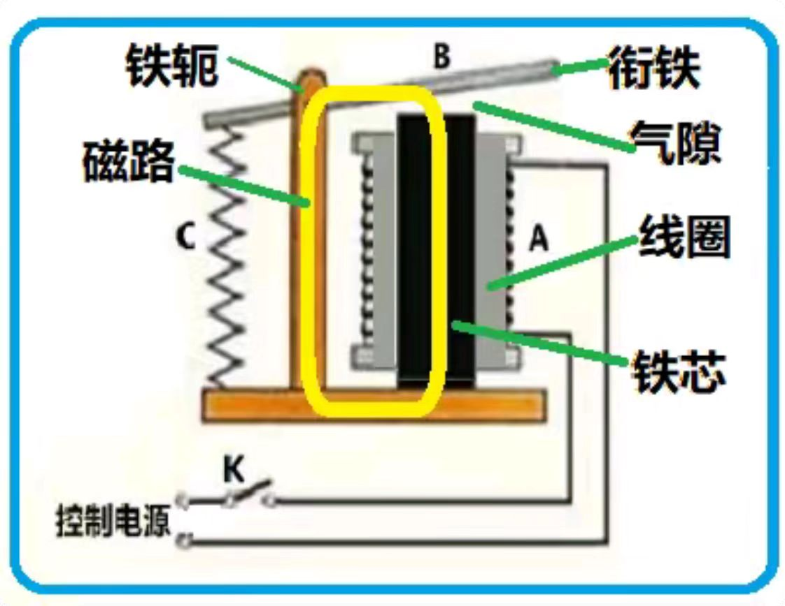
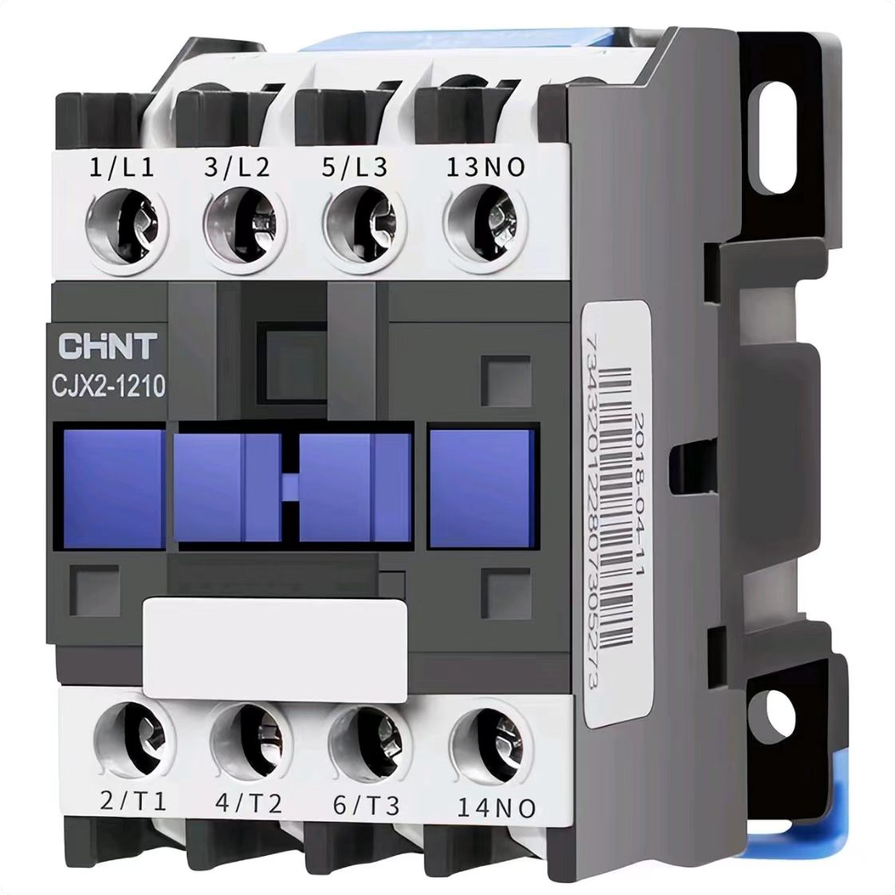
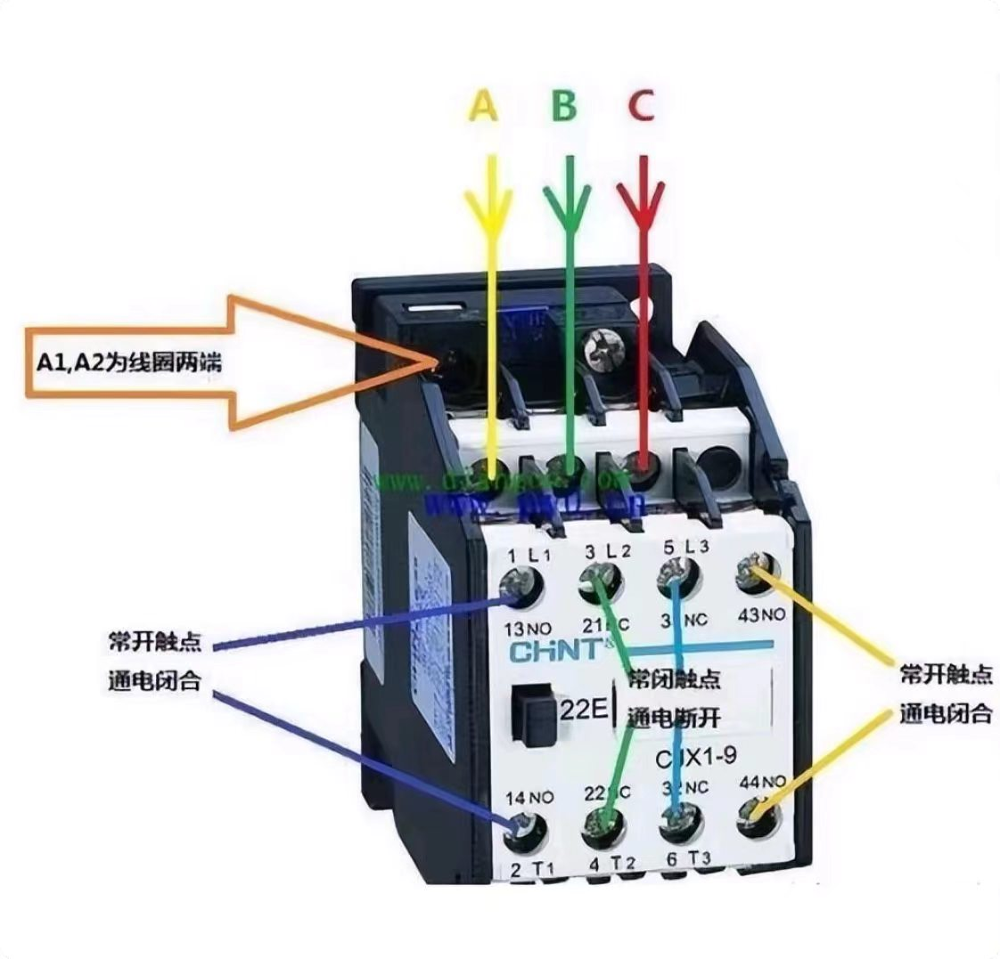
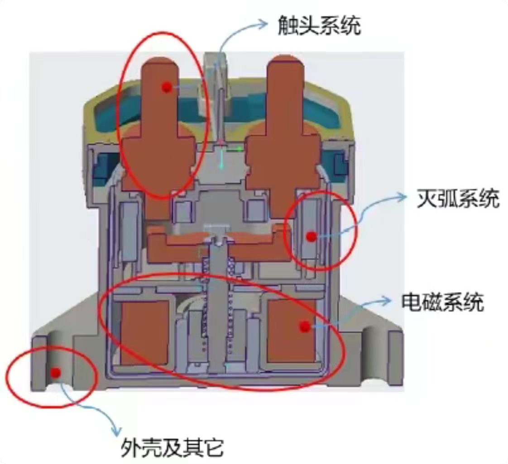
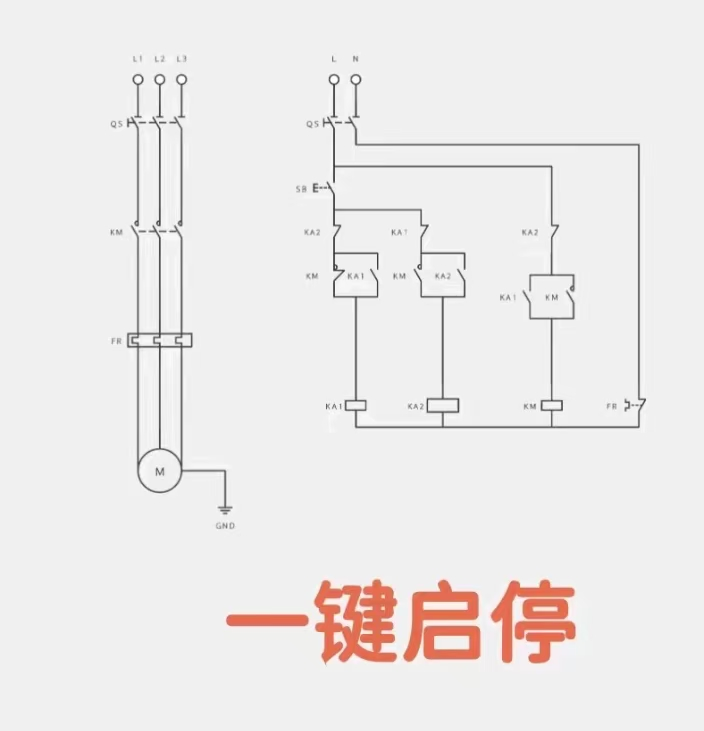

# 继电器、接触器与 MOS 管的区别

之前在单片机开发过程中，我就一直在思考一个问题：**继电器和 MOS 管究竟有什么区别？**

后来通过查阅资料，我对它们的工作原理有了一定的了解，也想把这些知识整理成笔记，方便日后查阅。

---

## 一、继电器（Relay）

### 1. 继电器的外观

先来看一下常见的单路继电器模块。

  

继电器在单片机开发中非常常见，可以通过 GPIO 引脚输出的电平信号控制外部电路的通断。

例如，在 Arduino 中，可以通过 `digitalWrite()` 控制继电器模块的输入端，从而控制灯具、电机等设备。

### 2. 继电器的触点

继电器常见的触点包括：

* **COM（公共端）**：触点切换的公共连接端。
* **NO（常开端）**：继电器未动作时与 COM 断开，继电器动作后与 COM 导通。
* **NC（常闭端）**：继电器未动作时与 COM 导通，继电器动作后与 COM 断开。

以常见的高电平触发继电器模块为例：

* 当 `IN = HIGH` 时，继电器线圈得电，COM 与 NO 导通，COM 与 NC 断开。
* 当 `IN = LOW` 时，继电器线圈失电，COM 与 NO 断开，COM 与 NC 导通。

需要注意：**以上逻辑适用于高电平触发的模块**。部分继电器模块采用低电平触发，实际工作逻辑需要参考模块的电路设计。

### 3. 多路继电器模块

  

多路继电器模块的工作原理与单路继电器基本一致，只是集成了多个继电器单元，可以分别控制多路电路。

在使用时，需要注意单片机的输出电流是否满足模块输入要求，以及继电器触点的额定电压和电流是否符合负载要求。

### 4. 继电器的内部工作原理

  

继电器的核心工作原理是利用**电磁力控制机械触点的切换**。

这里引用张老师关于继电器工作原理的一段说明：

> 我们把控制电源的开关 K 闭合，线圈通电，线圈按右手螺旋定则在铁芯中产生了磁力线，把铁磁材料构成的衔铁吸下来，直到气隙等于零。在衔铁的带动下，继电器的常开触点闭合，而常闭触点打开，至此完成了继电器的闭合过程。注意到此时反力弹簧被拉长产生了反力并作用在衔铁上。
>
> 当控制电源的开关打开后，线圈失电，铁芯中的磁力线瞬间消失，反力弹簧把衔铁拉回到原来的位置，常闭触点恢复导通，而常开触点也恢复打开的状态。

感兴趣的话，可以阅读张老师的原文：

[继电器的工作原理——知乎](https://www.zhihu.com/question/37052790/answer/934147451)

### 5. 继电器的特点

继电器的主要特点如下：

1. **电气隔离**：控制侧与触点侧可以实现电气隔离，具体隔离能力取决于器件和模块设计。
2. **适用范围广**：可用于交流、直流负载的通断控制，但必须符合触点的额定规格。
3. **存在机械磨损**：由于内部存在机械触点，长期使用会产生磨损。
4. **切换速度有限**：机械动作速度通常低于半导体开关。
5. **可能产生电弧**：切换较大电流或感性负载时，触点可能产生电弧。

---

## 二、接触器（Contactor）

### 1. 接触器的外观

  

接触器同样利用电磁力控制触点的通断，其工作原理与电磁继电器类似。

不过，接触器主要用于电动机、加热设备及其他较大功率负载的频繁通断控制，常见于工业控制和配电系统。

接触器并不是简单地通过增加触点数量来提高继电器的性能，而是在触点结构、灭弧能力、绝缘设计和机械寿命等方面针对相应的负载场景进行设计。

### 2. 接触器的工作过程

  

当接触器的线圈接收到符合要求的控制电压后，线圈产生磁场，吸引衔铁动作，使主触点闭合，接通负载电源。

当线圈断电后，衔铁在复位机构的作用下返回原位，主触点断开，负载停止供电。

### 3. 接触器内部结构

  

与普通继电器相比，接触器通常具有更适合大电流负载的触点结构，并且往往配备专门的灭弧结构。

在触点断开时，特别是切断电动机等感性负载时，电路中可能产生电弧。灭弧装置可以帮助熄灭电弧，降低触点烧蚀风险。

但需要注意：**配备灭弧结构并不意味着接触器可以承受任意电压和电流**。实际选型仍需要参考额定工作电压、额定工作电流、负载类别以及使用环境等参数。

### 4. 接触器的典型应用电路

  

上图展示了通过接触器控制三相电源向电气设备供电的典型电路。

其基本工作过程如下：

1. 控制回路向接触器线圈供电。
2. 接触器吸合，主触点闭合。
3. 三相电源通过主触点向负载供电。
4. 控制回路断电后，接触器释放，主触点断开，负载停止供电。

实际工业电路中，还可能配合断路器、热过载继电器、急停回路等保护装置使用。

**安全提醒：** 三相电路涉及危险电压，实际接线应由具备相应资质的人员完成，并做好隔离和保护措施。

---

## 三、继电器与接触器的区别

| 对比项目 | 继电器             | 接触器             |
| :--- | :-------------- | :-------------- |
| 主要用途 | 信号控制、一般负载切换     | 电动机及较大功率负载控制    |
| 触点结构 | 根据型号设计          | 通常针对主回路负载进行强化设计 |
| 灭弧能力 | 取决于具体型号         | 通常针对相应负载配置灭弧结构  |
| 控制方式 | 电磁式、固态式等        | 常见为电磁式          |
| 典型应用 | 单片机控制、信号切换、设备联锁 | 三相电机、工业设备、电力负载  |

需要注意，继电器和接触器的能力存在重叠，不能仅凭名称判断其能否控制某个负载，应以具体产品的额定参数为准。

---

## 四、MOS 管（MOSFET）

继电器和接触器属于机械式开关，而 MOS 管属于半导体开关器件。

在单片机开发中，MOS 管经常用于 LED 灯带、电机、电磁阀等负载的控制。与机械式开关相比，它没有机械触点，适合高速开关和 PWM 调光等应用。

### 1. MOS 管的工作原理

MOS 管通过栅极（Gate）电压控制漏极（Drain）与源极（Source）之间的导电状态。

以常见的 N 沟道增强型 MOS 管为例：

* 栅极电压达到相应驱动条件时，MOS 管导通。
* 栅极电压降低到关断条件时，MOS 管截止。

实际导通能力取决于栅源电压 `VGS`、器件参数及工作条件。单片机使用时，应该选择在相应栅极电压下具有明确导通电阻参数的逻辑电平 MOS 管。

### 2. MOS 管的特点

1. **开关速度快**：适合高频开关控制。
2. **没有机械触点**：不存在机械触点磨损和触点电弧问题。
3. **适合 PWM 控制**：可通过改变占空比调节 LED 亮度或电机功率。
4. **导通时存在损耗**：主要包括导通损耗和开关损耗。
5. **需要注意驱动条件**：栅极电压、电流能力、散热和感性负载保护都需要合理设计。
6. **不一定提供电气隔离**：普通 MOS 管的控制端与功率回路之间通常没有继电器那样的触点隔离。

---

## 五、继电器、接触器与 MOS 管如何选择？

如果是在单片机项目中控制外部设备，可以根据以下原则选择：

* **控制交流灯具或需要电气隔离的负载**：可以考虑合适规格的继电器。
* **控制三相电动机或工业大功率负载**：通常需要根据负载类别选用接触器，并配置相应保护装置。
* **控制低压 LED 灯带、调节灯光亮度**：通常优先考虑 MOS 管。
* **需要快速、频繁地切换负载**：通常更适合采用 MOS 管等半导体开关。
* **需要机械触点实现回路切换**：可以考虑继电器或接触器。

最后需要记住：**继电器、接触器和 MOS 管并不是简单的替代关系，而是针对不同电压、电流、开关频率、隔离需求和负载特性选择的不同器件。**
